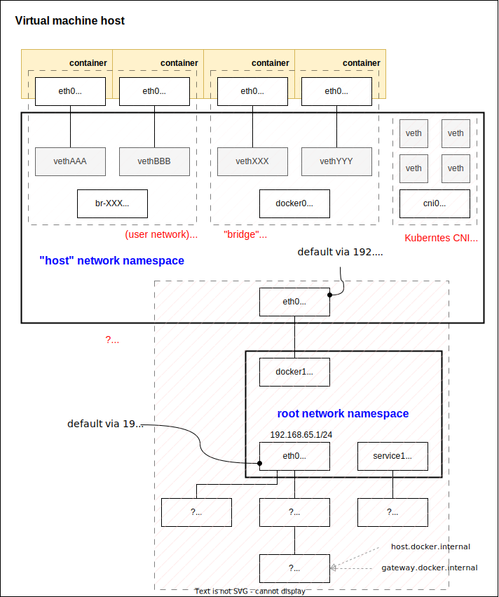

## Network diagram of Docker Desktop for Mac


## Host to inspect

```
docker run -it --rm alpine arp
docker run -it --rm alpine ip route
docker run -it --rm alpine route -n
docker run -it --rm alpine ifconfig

docker run -it --net learn-docker --rm alpine arp
docker run -it --net learn-docker --rm alpine ip route
docker run -it --net learn-docker --rm alpine route -n
docker run -it --net learn-docker --rm alpine ifconfig

docker run -it --rm --net host alpine arp
docker run -it --rm --net host alpine ip route
docker run -it --rm --net host alpine route -n
docker run -it --rm --net host alpine ifconfig

docker run --privileged --pid=host -it --rm alpine:3.18.3 nsenter -t 1 -m -u -n -i -- arp
docker run --privileged --pid=host -it --rm alpine:3.18.3 nsenter -t 1 -m -u -n -i -- ip route
docker run --privileged --pid=host -it --rm alpine:3.18.3 nsenter -t 1 -m -u -n -i -- route -n
docker run --privileged --pid=host -it --rm alpine:3.18.3 nsenter -t 1 -m -u -n -i -- ifconfig
```

https://serverfault.com/questions/818784/how-to-match-both-sides-of-a-virtual-ethernet-link
